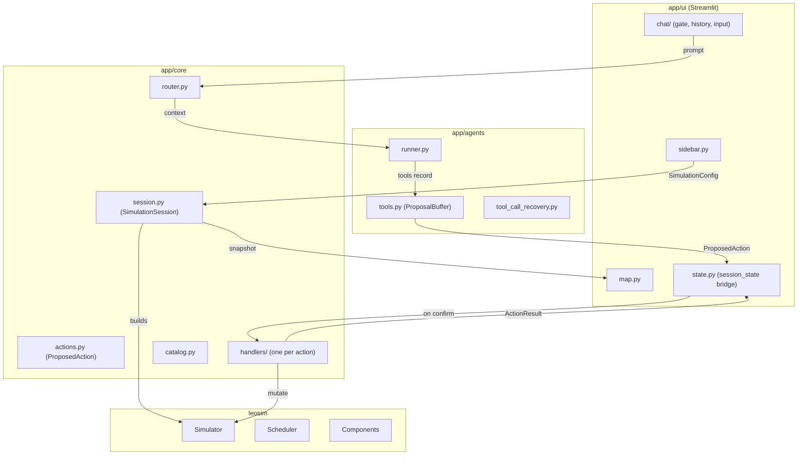

# LEOSim Architecture

High-level guide to the LEOSim system: its layers, how state flows through
them, and the rules that keep them apart.

---

## Layers

LEOSim is split into four layers. The structural rule that holds them apart:
**`streamlit` may only be imported inside `app/ui`**. It is enforced by
`tests/test_layering.py`, not by convention.

| Layer | Package | Responsibility |
| --- | --- | --- |
| Simulation engine | `leosim/` | Satellites, ground stations, users, topology, scheduling |
| Application domain | `app/core/` | Session state, actions, handlers, snapshots, routing |
| Agent orchestration | `app/agents/` | Prompts, tools, agent runs, tool-call recovery |
| Interface | `app/ui/` | Streamlit widgets, map, chat, theme |

`app.py` is the composition root: it wires the interface to the domain and
owns nothing of the simulation itself.

---

## State ownership

A single `SimulationSession` object owns everything about a running
simulation: the `Simulator`, the snapshot history, the viewed index, the
scheduled steps and the satellite catalog. Streamlit stores that one object
under a single key.

`app/ui/state.py` is the only module that knows the `st.session_state` key
names. Everything else reaches the session through its accessors.

### Snapshots

Every snapshot is a JSON-serializable dictionary produced by
`app/core/snapshot.py`:

* `step` — the simulator tick at capture time
* `label` — what the capture represents (`"Step 3"`, `"Step 3 · change 1"`)
* `satellites`, `ground_stations`, `users`, `links` — component telemetry

The history holds two kinds of capture. A **tick** advances the clock. An
**infrastructure change** does not: it recomputes connectivity and records a
new snapshot at the same tick, so the operator sees the effect immediately
without consuming simulation time. The label keeps the two apart.

---

## The action cycle

The agent never mutates the engine. Every change goes through the same cycle:

1. The operator types a command. `app/core/router.py` decides whether to
   answer locally, refuse, or forward it to the agent.
2. When forwarded, `app/agents/runner.py` builds an agent whose tools write
   into a `ProposalBuffer` scoped to that single run.
3. Each tool records a typed `ProposedAction` (an `ActionType` plus a
   validated payload) and returns a confirmation sentence to the model.
4. The interface stores the proposal and renders the confirmation gate.
5. On **Confirm**, `app/core/executor.py` looks up the handler registered for
   the action type and runs it. The handler mutates the engine and returns an
   `ActionResult` carrying messages and, for a restart, a replacement session.
6. On **Cancel**, the proposal is discarded and the chat is told.

Handlers return what should be said; they never write to the chat or raise a
toast themselves. `app/ui/state.apply_result` translates the result into
interface effects.

---

## Directory map

* `app.py` — composition root for the Streamlit dashboard
* `main.py` — CLI for head-to-head runs of allocation algorithms
* `dataset.py`, `dataset_generator/` — topology and component construction
* `app/core/`
  * `session.py` — `SimulationSession`: the owner of simulation state
  * `config.py` — `SimulationConfig`: validated simulation parameters
  * `actions.py` — `ProposedAction` and the typed payloads
  * `handlers/` — one module per action; `executor.py` dispatches to them
  * `infrastructure.py` — primitives for creating nodes and attaching units
  * `catalog.py` — indexed satellite traces
  * `snapshot.py`, `summary.py` — state for the map and for the agent
  * `router.py` — command routing, free of interface calls
* `app/agents/`
  * `tools.py` — `ProposalBuffer` and the `propose_*` tools
  * `runner.py` — agent assembly and execution
  * `tool_call_recovery.py` — recovery of tool calls emitted as text
  * `prompts.py` — system description and instructions
* `app/ui/`
  * `state.py` — the only bridge to `st.session_state`
  * `sidebar.py`, `map.py`, `header.py`, `css.py`, `ollama.py`
  * `chat/` — `gate.py`, `history.py`, `input.py`
  * `gui/` — icons, themes, accessibility script
* `leosim/` — the simulation engine
* `tests/` — the centralized test directory

---

## Operational rules

See [RULES.md](RULES.md) for the behavioural rules derived from operator
feedback. Two structural rules are enforced by tests:

1. **Layer boundary** — `streamlit` only inside `app/ui`
   (`tests/test_layering.py`).
2. **Test placement** — every test lives under `tests/`.
