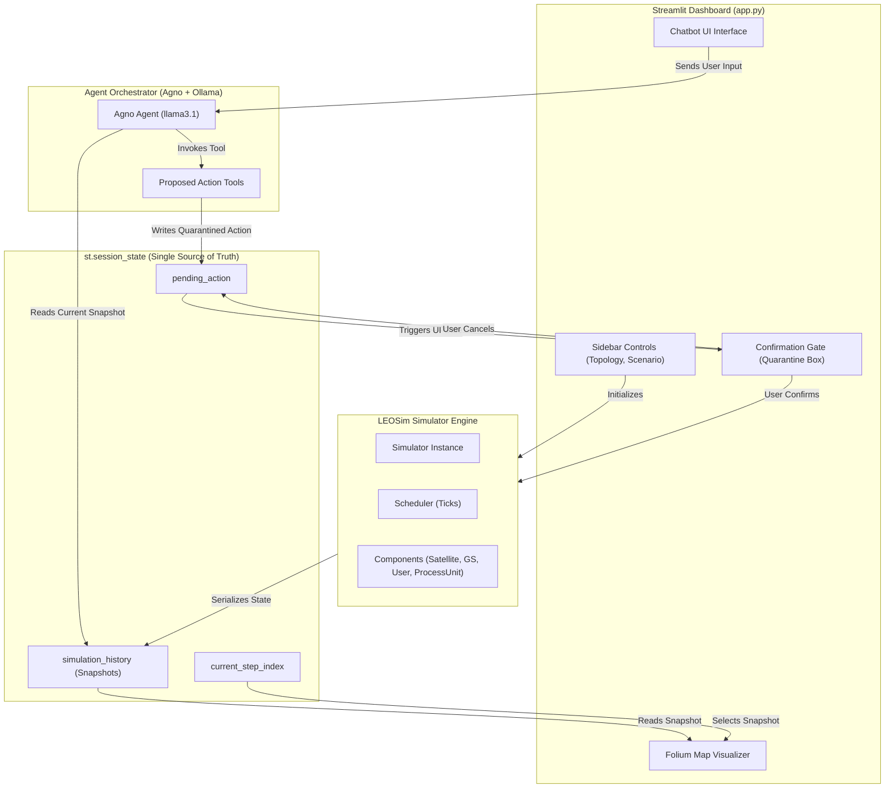

# LEOSim Architecture Document

Welcome to the LEOSim architecture guide. This document provides a high-level overview of the LEOSim system architecture, state management, components, and interactive agent loops. It is designed to quickly onboard new developers and AI agents to the codebase.

---

## 🏗️ High-Level System Architecture

LEOSim is structured into three primary layers:
1. **Simulation Engine (`leosim`)**: A discrete-event-like simulation engine written in Python that manages satellites, ground stations, users, and network topologies.
2. **Dashboard UI (`app.py` via Streamlit & Folium)**: A rich, interactive frontend that visualizes the network on a world map and lists full telemetry.
3. **Agent Orchestration Layer (`Agno` & `Ollama`)**: An LLM-powered assistant (using `llama3.1`) that helps the operator monitor, review, and control the simulation via natural language.

---

## 📂 Project Directory Structure

Here are the key directories and files:
*   [app.py](file:///mnt/shared/projects/agleo/app.py): The main entry point for the Streamlit dashboard and LLM orchestrator agent loop.
*   [dataset.py](file:///mnt/shared/projects/agleo/dataset.py): Utility functions to generate the initial topology, connect users, and attach process units.
*   [main.py](file:///mnt/shared/projects/agleo/main.py): CLI interface to run head-to-head simulations of resource allocation algorithms.
*   [docs/RULES.md](file:///mnt/shared/projects/agleo/docs/RULES.md): The golden operational rules derived from user feedback (strict rules on tests location, informational agent behavior, Streamlit UI stability, and Axe accessibility).
*   [leosim/](file:///mnt/shared/projects/agleo/leosim/):
    *   [simulator.py](file:///mnt/shared/projects/agleo/leosim/simulator.py): The main coordinator class of the simulation engine.
    *   [scheduler.py](file:///mnt/shared/projects/agleo/leosim/scheduler.py): Ticks and triggers scheduling of components.
    *   [components/](file:///mnt/shared/projects/agleo/leosim/components/): Defines `Satellite`, `GroundStation`, `User`, `ProcessUnit`, `NetworkLink`, `Application`, etc.
*   [dataset_generator/](file:///mnt/shared/projects/agleo/dataset_generator/):
    *   [create_components.py](file:///mnt/shared/projects/agleo/dataset_generator/create_components.py): Helper methods to instantiate and link nodes.
*   [tests/](file:///mnt/shared/projects/agleo/tests/): The centralized test directory.

---

## 💾 State Management & Serialization

Streamlit's `st.session_state` is the single source of truth for the dashboard UI. The simulation history is kept in memory as a list of JSON-serializable snapshots:

*   `st.session_state["simulation_history"]`: A list of dictionary objects representing the state of all components at each tick.
*   `st.session_state["current_step_index"]`: The index in the history currently visualized by the user. Scrubbing the timeline slider updates this index, rendering past states.
*   `st.session_state["pending_action"]`: Holds a quarantined tool proposal that is waiting for explicit user confirmation in the UI.

### Snapshot Structure
Each step snapshot (created via `serialize_state()` in `app.py`) contains:
*   `step`: Current simulation tick integer.
*   `satellites`: Telemetry trace including coordinates, gateway status, activity status, and CPU/Memory of any attached `ProcessUnit`.
*   `ground_stations`: Server process units, coordinates, and wireless delays.
*   `users`: Connected access points and demands of all associated applications.
*   `links`: Bandwidth, delay, source, target, and dynamic/static types of all active network links.

---

## 🤖 Orchestrator Agent & Confirmation Gate

The `Agno` agent acts as a command orchestrator. It runs locally via `Ollama` using the `llama3.1` model.

### Informational vs. Mutative Context
*   **Informational Queries**: If the user asks informational questions (e.g., *"How many users are connected?"*), the agent reads the current snapshot from its system prompt context and responds **textually only**. It must **never** call any tools.
*   **Mutative Commands**: If the user explicitly asks to control the network (e.g., *"Add a server to GroundStation 28"*, *"Run simulation for 5 steps"*, `/step 5`, `/restart`), the agent invokes the corresponding tool (e.g., `propose_add_process_unit`).

### The Confirmation Gate Mechanics
When the agent executes a control tool, the tool does **not** directly mutate the backend engine. Instead:
1.  The tool sets `st.session_state["pending_action"]` to the action payload.
2.  A visual quarantine block (the Confirmation Gate) is rendered on the UI.
3.  If the operator clicks **Confirm**:
    *   The corresponding real execution function (e.g. `execute_pending_action`) is called.
    *   The simulator engine processes the change and runs the internal `.step()`.
    *   A new snapshot is appended to `st.session_state["simulation_history"]`.
    *   The `current_step_index` is updated to point to the new state.
    *   The buffer is cleared and `st.rerun()` is invoked.
4.  If the operator clicks **Cancel**:
    *   `pending_action` is cleared.
    *   A notification is appended to the chat, allowing the agent to stand down.

---

## ⚠️ Core Operational Rules for Developers/Agents

When modifying LEOSim, you must respect these rules at all times (registered in [docs/RULES.md](file:///mnt/shared/projects/agleo/docs/RULES.md)):

1.  **Test Placement**: Keep all testing scripts under `tests/`. Do not run tests in `scratch/`.
2.  **No Unprompted Action Proposals**: Do not call proposal tools during conversational/informational questions.
3.  **Visual Stability**: Prevent "widget ghosting" in Streamlit by using static widget calls with dynamic arguments and unique keys.
4.  **A11y & Contrast**: Run playwright tests ([axe_validation.js](file:///mnt/shared/projects/agleo/tests/axe_validation.js)) to verify contrast and WCAG landmark structures.
